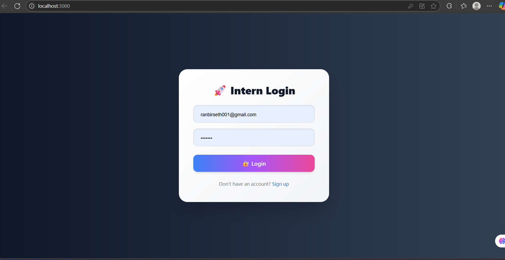
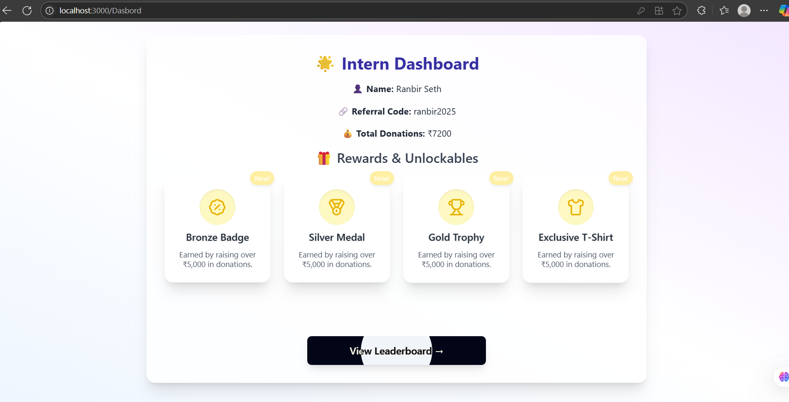
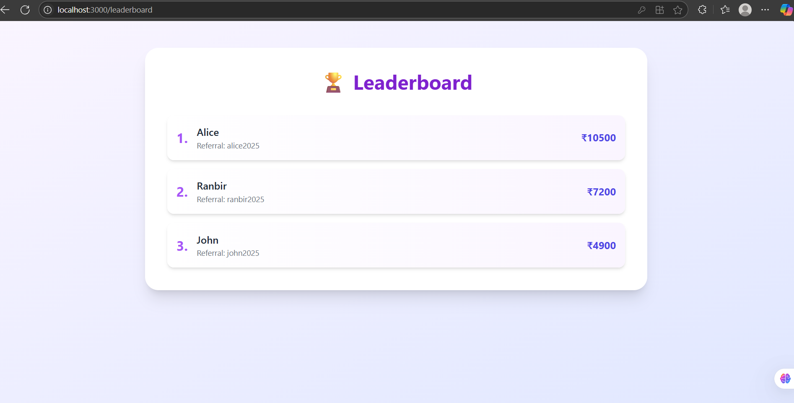

# She Can Foundation Assignment

A full-stack web application for tracking intern donations, rewards, and leaderboard rankings. Built with React, Tailwind CSS, and Express.

---

## 🚀 Project Overview

This project simulates an intern dashboard for the She Can Foundation. Interns can log in, view their donation stats, unlock rewards, and see their ranking on a leaderboard. The UI is modern, animated, and responsive.

---

## ✨ Features

- **Intern Login:** Simple login form (no real authentication).
- **Dashboard:** View intern details, referral code, total donations, and unlocked rewards.
- **Leaderboard:** See top interns ranked by donation totals.
- **Animated UI:** Smooth transitions and interactive elements using Framer Motion.
- **Responsive Design:** Looks great on all devices.

---

## 🛠️ Tech Stack

- **Frontend:** React, Tailwind CSS, Framer Motion, Lucide Icons, React Router
- **Backend:** Node.js, Express, CORS

---

## 📁 Project Structure

```
She Can Foundation assigment/
│
├── Backend/
│   ├── server.js
│   └── package.json
│
└── Frontend/
    └── my-project/
        ├── src/
        │   ├── App.jsx
        │   ├── pages/
        │   │   ├── Login.jsx
        │   │   ├── Dasbord.jsx
        │   │   └── Leaderboard.jsx
        │   ├── component/
        │   │   └── RewardCard.jsx
        │   └── ...
        ├── public/
        └── ...
```

---

## 🖥️ Frontend Components

- **App.jsx:** Main router for the app.
- **pages/Login.jsx:** Login form with redirect to dashboard.
- **pages/Dasbord.jsx:** Displays intern info, rewards, and leaderboard button.
- **pages/Leaderboard.jsx:** Animated leaderboard of top interns.
- **component/RewardCard.jsx:** Animated card for each reward.

---

## 🔗 Backend Endpoints

- `GET /api/intern`  
  Returns mock intern data:
  ```json
  {
    "name": "Ranbir Seth",
    "referralCode": "ranbir2025",
    "totalDonations": 7200
  }
  ```

- `GET /api/leaderboard`  
  Returns a mock leaderboard array:
  ```json
  [
    { "name": "Alice", "referralCode": "alice2025", "totalDonations": 10500 },
    { "name": "Ranbir", "referralCode": "ranbir2025", "totalDonations": 7200 },
    { "name": "John", "referralCode": "john2025", "totalDonations": 4900 }
  ]
  ```

---

## ⚡ Getting Started

### 1. Clone the Repository

```bash
git clone <repo-url>
cd "She Can Foundation assigment"
```

### 2. Start the Backend

```bash
cd Backend
npm install
node server.js
```

### 3. Start the Frontend

```bash
cd Frontend/my-project
npm install
npm start
```

- The frontend expects the backend to run on `http://localhost:5000`.

---

## 📸 Screenshots





---

## 📝 Notes

- This project is for demonstration and assignment purposes.
- No real authentication or database is used; all data is mocked.
- For any questions, contact the author.

---

## 👤 Author

- **Ranbir Seth**

---
